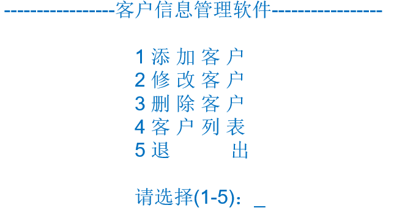
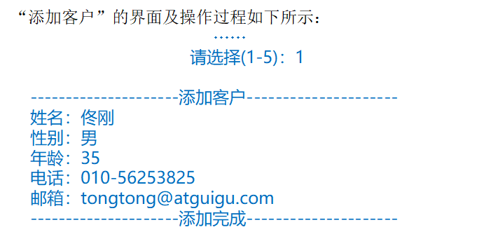
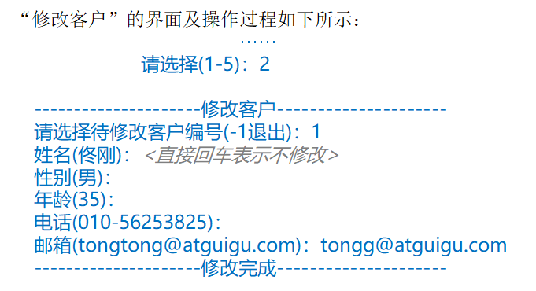
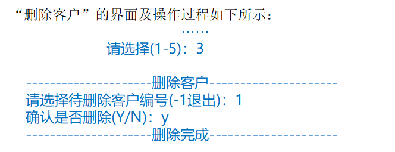
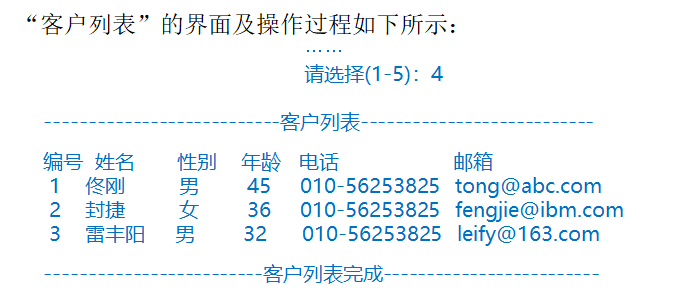
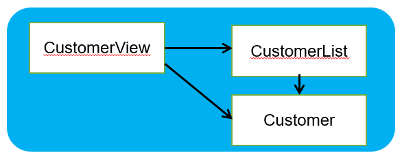

# Project 2 客户信息管理软件

- 模拟实现一个基于文本界面的《客户信息管理软件》，该软件能够实现对客户对象的插入、修改和删除（用数组实现），并能够打印客户明细表
- 进一步掌握编程技巧和调试技巧，熟悉面向对象编程
- 主要涉及以下知识点：
  - 类结构的使用：属性、方法及构造器
  - 对象的创建与使用
  - 类的封装性
  - 声明和使用数组
  - 数组的插入、删除和替换
  - 关键字的使用：this

## 主菜单如下：

 

•每个客户的信息被保存在Customer对象中。

•以一个Customer类型的数组来记录当前所有的客户。

•每次“添加客户”（菜单1）后，客户（Customer）对象被添加到数组中。

•每次“修改客户”（菜单2）后，修改后的客户（Customer）对象替换数组中原对象。

•每次“删除客户”（菜单3）后，客户（Customer）对象被从数组中清除。

•执行“客户列表 ”（菜单4）时，将列出数组中所有客户的信息。

## “添加客户”

 

 ## “修改客户”

 ## 删除客户

## 客户列表

 

## 分析

软件由三个模块组成

 